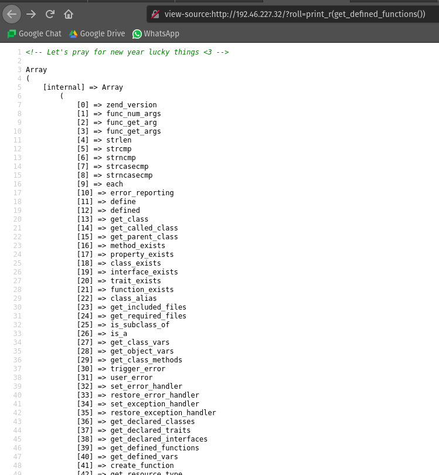
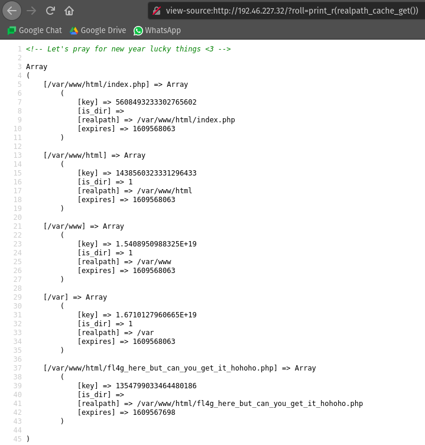

# HPNY

## Descripción del reto

```

Get some lucky word or number for your new year!
http://192.46.227.32/?roll=get_lucky_word
```

## Solución


In this challenge, they gave us the URL of a website where upon entering you would get a happy new year message in different languages ​​every time you refreshed the site.
At the beginning there was nothing suspicious, with no traces of robots.txt, scripts, cookies, etc... so we proceeded to request again the site without any parameter at the URL http://192.46.227.32/ and we obtained the following output.


And there were two random functions so we did not pay attention to them but
there was also a conditional where if you didn't send the roll parameter using the GET verb
it would show us the source code of the constant __FILE__.

In case of not entering in the conditional we would run into the first technical challenge, a regular expression
which only allowed lowercase characters from a to z, underscore and a dot, this came from the roll parameter through the GET verb, in addition we should not exceed a 50 characters length.

If we did not enter in the condition of the regular expression then we would not get to the most important thing, the eval, which evaluates the expression passed as a parameter, being this one of the most dangerous functions if it falls into the wrong hands.



Thanks to the challenge hint we deduce that using the get_defined_functions function we could obtain all the defined functions that we could use and through print_r we could show the array of the functions that could be evaluated once the regular expression is passed.

At this point we were lost for a long time because we did not know which of the 1116 functions of the array would help us to obtain the flag, so we decided to first find a way to know if there were more files in the directory of the website besides the index.php, and this was how we got to the scandir function which returns an array with the files and directories that are under the directory that is passed as an argument, however, it was not going to be that simple since the regular expression was not going to allow us enter commas, quotes, variables, etc, so after a long time we thought that if there was the constant __FILE__ which returned /var/www/html/index.php then there would be the constant __DIR__ returning /var/www/html... of course it would have been easier to write directly '/var/www/html' but the regular expression did not allow it, so doing this we obtained the list of files in the directory.


In this way we knew there was a hidden file called fl4g_here_but_can_you_get_it_hohoho.php that contained the flag, but we could not read the content even though we knew its path since it did not show anything so we proceeded to find a function that could read the file but there was a big problem, before using a function that read files through the path of one, we had to convert the array that scandir returned to be only a string with the path fl4g_here_but_can_you_get_it_hohoho.php but the array had this string in the position 2 and due to to the regular expression it was impossible to use brackets or numbers since it only allowed characters from a-z so accessing the array as scandir (__ DIR __)[2] would not be possible.



Here we come to the most interesting part of the challenge where Lupita found an incredible function to solve it and i am talking about the realpath_cache_get function that returns the paths of the cache entries.

It's important to mention that it was necessary to visit the page fl4g_here_but_can_you_get_it_hohoho.php so in this way the page could be saved in the CACHE and it would be inserted at the end of the array, otherwise it would never appear in it and it would be impossible to solve the challenge.

As you can see in the image, the result obtained was similar to scandir, however, it returned an array of arrays, and unlike scandir, it also returned fl4g_here_but_can_you_get_it_hohoho.php but in the last position of the array (thanks to the cache) so using the array_pop function, which returns the last element of an array, Lupita obtained the array that contained fl4g_here_but_can_you_get_it_hohoho.php, but there was still a problem, we still had a new array and it was impossible to access its positions ...


Until using the array_keys function we were able to obtain the key of the associative array obtaining fl4g_here_but_can_you_get_it_hohoho.php and we already had the pure string 'fl4g_here_but_can_you_get_it_hohoho.php' ready to be used with some other function that could read the content of a file and display its contents. 
But now we had a new problem ...


We had already exceeded the length of 50 characters so it didn't allow us to execute anything so Lupita found a function called end () which returned the value of the last position of the array and being shorter thant array_pop gave us more margin to write a new function.


Now it was just to automating things so through GO we made it to execute all the functions that its name had a length less or equal to 11 characters since our string measured 37 and we could not exceed 50 characters since
37 + 11 = 48 + 2 = 50 where those 2 are the opening and closing parenthesis of the new function.


In this way we found the readgzfile function which reads a file, decompresses it and writes it to the standard output  obtaining the flag.


